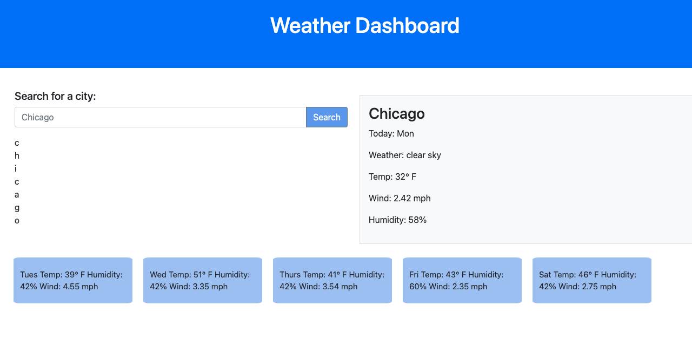

# Module 06 Challenge, Server-Side APIs: Weather Dashboard

Create a weather daily forecast webpage.

Note: Unfortunately I was not able to complete this challenge by the due date. I am submitting what I have so far with the intention of continuing to work on the project and resubmitting a working page at a later date.

## Installation

Github: https://github.com/lizedelman/Mod6Challenge

## Completed Page

## User STory

User Story
AS A traveler
I WANT to see the weather outlook for multiple cities
SO THAT I can plan a trip accordingly

## Acceptance Criteria

GIVEN a weather dashboard with form inputs
WHEN I search for a city
THEN I am presented with current and future conditions for that city and that city is added to the search history
WHEN I view current weather conditions for that city
THEN I am presented with the city name, the date, an icon representation of weather conditions, the temperature, the humidity, and the wind speed
WHEN I view future weather conditions for that city
THEN I am presented with a 5-day forecast that displays the date, an icon representation of weather conditions, the temperature, the wind speed, and the humidity
WHEN I click on a city in the search history
THEN I am again presented with current and future conditions for that city

## Credits

Collaborators include my tutor Michelle Jordan.

## License

License: CC0-1.0

